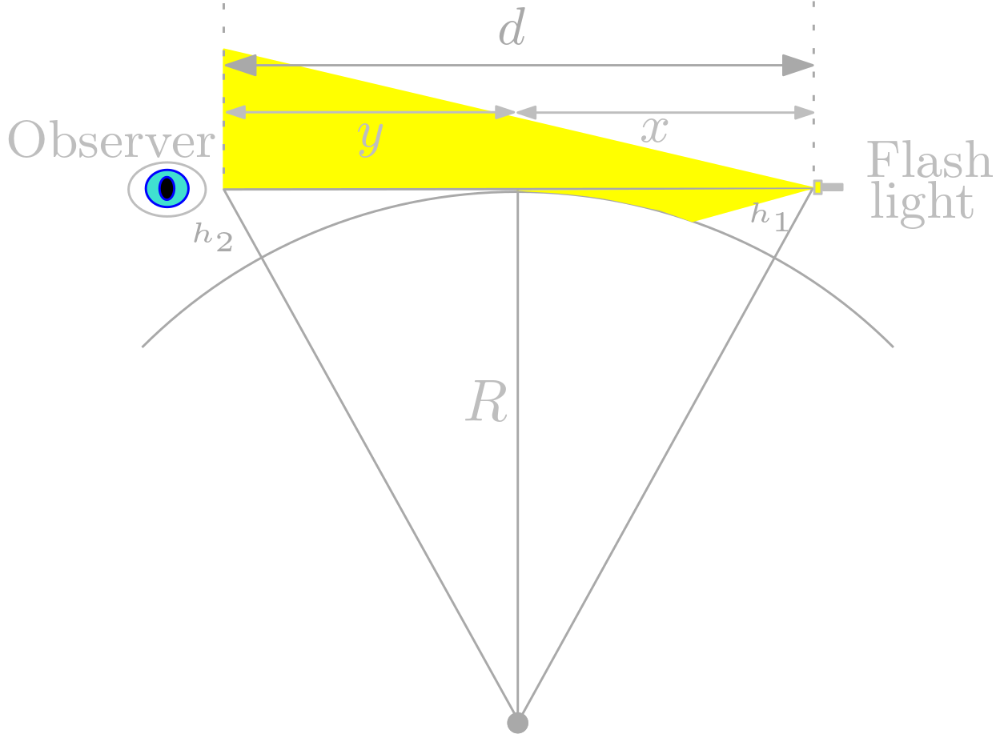

## Estimating earth size

Did you know that one can measure the Earth without any scientific equipment? You only need
* a big water surface such as a lake; ideally there should be two places at least 5 km (3 miles) distant from each other that you can both access
* a flash light, stronger is better (but we even tried with an iphone flash and it kind of worked)
* two people
* a measuring rod or any tooling to measure height above water, up to 2 meters at least

Apart of estimating Earth diameter, you can also show your flat-Earther friends that the Earth is, indeed, round. 
Or if not, then at least you demonstrate that *most lakes are in fact "hills".*

## The design

After sunset or before dawn.

The flashlight is fixed and not moving, at some height over the water. The height we will refer to as $h_1$, for instance 1 meter. Practically, you will do several
rounds of the experiment with possibly different values, and record everything.

The distant observer on the other side of the lake can only see the light if his eyes are at certain minimal height $h_2$. 
If his/her eyes are higher, (s)he sees the light. If they are lower, light becomes invisible. In each experiment round, you will try to record this minimal 
height $h_2$.

If the distance between the flashlight and the observer is $d$, then we can estimate the earth circumference from this.

## Some formulas

By Pytagorean theorem, we have

$$ R^2 + x^2 = (R+h_1)^2 $$

$$ R^2 + y^2 = (R+h_2)^2  $$

So we get $x = \sqrt{2Rh_1 + h_1^2}$, $y=\sqrt{2Rh_2 + h_2^2}$, and 

$$ d = x + y = \sqrt{2Rh_1 + h_1^2} + \sqrt{2Rh_2 + h_2^2}.       (1) $$

From this, we can estimate $R$, once we know the other variables. Or similarly, we can estimate $h_2$ if we know everything else.

To compute $R$ from (1), we will neglect $h_i^2$ terms as these are much smaller than $Rh_i$. So after this simplification,

$$ d \simeq \sqrt{2R}(\sqrt{h_1} + \sqrt{h_2}) $$

and 

$$ R \simeq \frac{d^2}{2(h_1 + h_2 + \sqrt{h_1 h_2})}.     (2) $$

If you want a perfect solution for $(1)$, you can reformulate it to a rather long quadratic equation for $R$ and solve exactly, I enourage you to do a PR.
For instance, if $d = 5000m$ ($5\,\, km$), $h_1 = 1m$ and $h_2 = 2m$, then the earth radius estimate by $(2)$ would be $2\,144\,660.94\,\,m$ and by a numerical solution of $(1)$ it would be $2\,144\,660.148 \,\,m$. This has nothing to do with "real" Earth radius, but you see that the solutions are very close, so it's ok to use the $(2)$ simplification.

From the equations above, it should also be clear that from a height $h$, you can see and can be seen from a distance of max $\sqrt{2Rh + h^2}$.