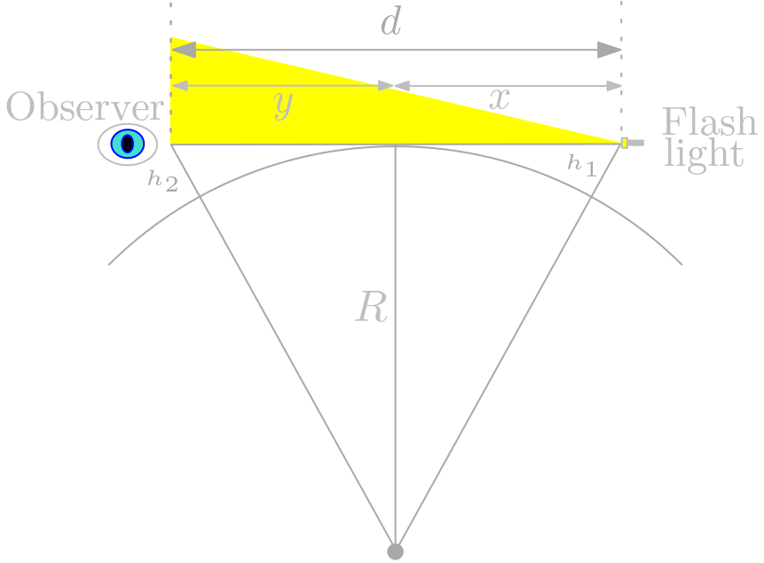

## Estimating earth size

You can prove that the Earth is round and estimate how big using a flash light and a large lake where you can find two places ideally at least 5 km (3 miles) apart from each other.

The flashlight is at some altitute over the water, let's call it $h_1$, let's say 1 meter. 
The distant observer on the other side of the lake can only see the light if his eyes are at certain minimal altitude $h_2$.
If the distance between the flashlight and the observer is $d$, then we can estimate the earth circumference.

## Some formulas

